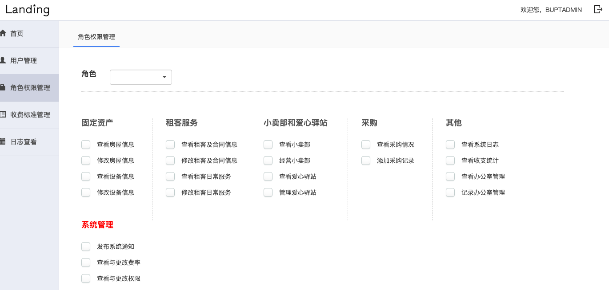
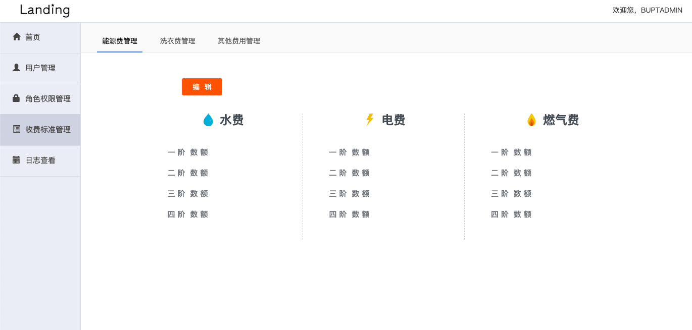
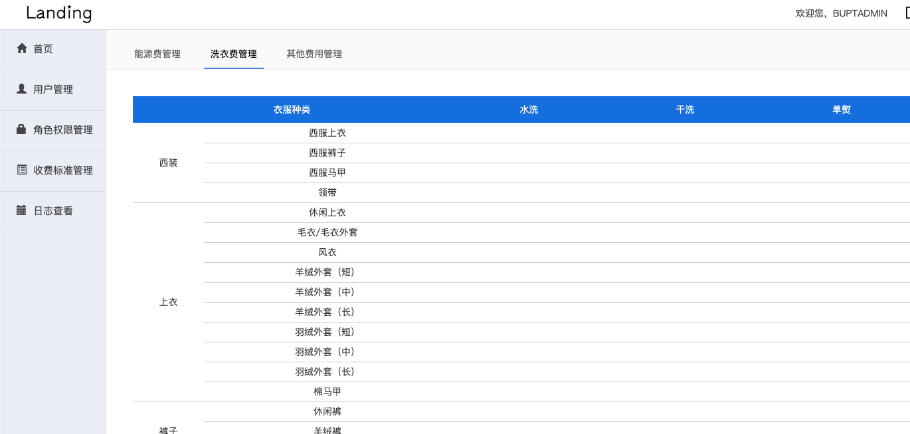
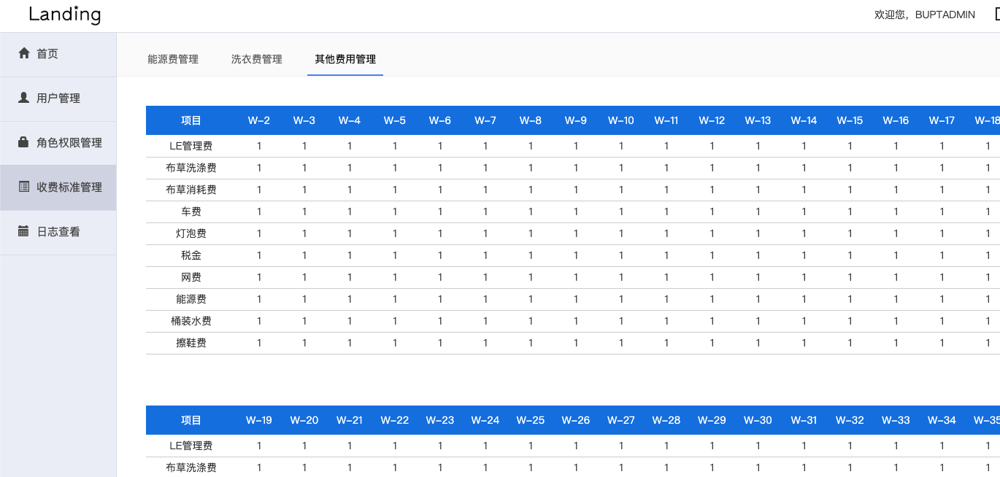
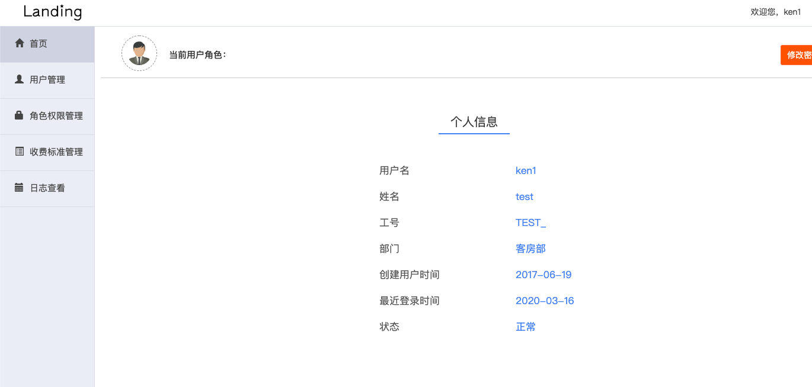

# 毕业设计酒店管理系统

> 可用于毕业设计参考或者个人学习用

- spring+srpingMVC+mybatic+mysql
- jsp

#### 实现功能
- [x] 管理员/财务/客房的登录与登出  
- [x] 管理员，财务，客房各角色的权限管理  
- [x] 收费标准管理 
- [x] 各个模块数据导出Excel
- [x] 操作日志查询

#### 部分截图

# 源码完整版 可加qq：625285133 咨询获取，可一对一专业指定需求，个性化制定代码。
# 后续持续更新新系统，敬请期待！

